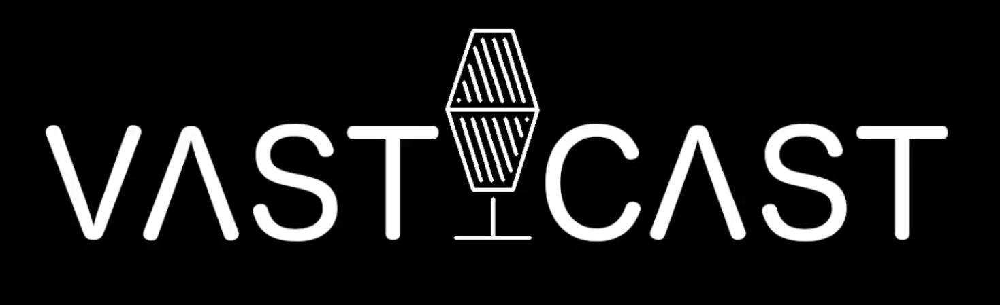

### [Home](https://mlpearson4.github.io/VastCast/) | [Deliverables](https://mlpearson4.github.io/VastCast/Deliverables.html) | [About Us](https://mlpearson4.github.io/VastCast/AboutUs.html)

# VastCast - A Vastly Superior Podcast App

VastCast is a Podcast App that allows users to play podcasts, load their favorite podcasts, organize their queue of podcasts, search for podcasts, and upload and download podcasts for offline listening.

## Importance

VastCast's goal is to create a simple, user-friendly design that integrates features with customers in mind.

## Goal Functionality

The application will be built for Android. The application should provide a user-friendly experience, while still addressing all the user’s needs. VastCast will utilize RSS feeds to retrieve desirable podcasts for users to download or stream on their devices. VastCast will provide features such as search, download, subscribe, silent skip, add, remove, and play to give the users the ultimate experience.

## Android Benefits

VastCast focuses on the strengths of each Android and IOS podcast apps on the market to create a desirable product for Android users. VastCast is also aware of some of the less desirable features and mistakes done by prior podcast apps on the market to avoid replicating again.

## Use of Our App

VastCast was designed to operate in a straightforward and user friendly manner. This [video](https://youtu.be/z5pGnDHEjq8 "VastCast Video"), also shown below, demonstrates most of the basic features for navigating our application and selecting and adding podcasts to listen to. 

To play a podcast, a user simply needs to click the play button. Once clicked, the user can listen to the podcast straight through, use the seek bar to select a location, skip ahead by either 5, 10, or 30 seconds, or click the next button to advance to the next podcast. The skip time can be controlled in settings. The settings menu also allows a user to log-out of our application.

VastCast also offers a search menu where users can search for a podcast title using either whole words or portions of words. Search is not case-sensitive.

